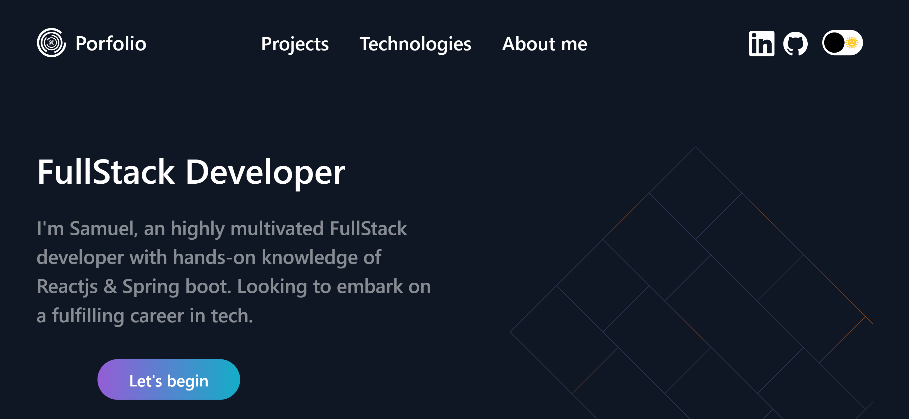

# Portfolio Website



## Overview

Welcome to my personal portfolio website built using ReactJS. This website serves as a showcase of my skills, projects, and achievements. Feel free to explore and learn more about me!

## Features

- **Responsive Design**: Ensures optimal viewing experience across various devices.
- **Project Showcase**: Highlighting my notable projects with details and links to their repositories or live demos.
- **About Me Section**: A brief introduction to who I am, my skills, and my professional journey.
- **Contact Information**: Easy ways to get in touch with me, including links to my social media profiles and email.

## Technologies Used

- ReactJS
- HTML5
- CSS3
- [Additional libraries or tools you've used]

## Getting Started

1. Clone the repository.
   ```bash
   git clone https://github.com/your-username/your-portfolio.git
